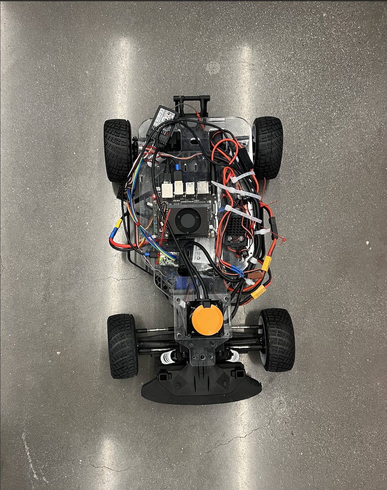

# F1TENTH Racecar: Simulation and Physical Car
This repository contains code for both the F1TENTH simulation environment and the physical F1TENTH racecar, using the MIT BWSI Racecar API (```racecar_core```) for control and sensor interaction.



## Overview
* Simulation Code: Implements wall-following using a 360 degree LiDAR in a controlled environment
* Physical Car Code: Adapts the simulation logic for a 270 degree LiDAR on the NVIDIA Jetson Xavier NX

## Installation
1. Clone the installer (requires Python 3.9 or lower):
```
git clone https://github.com/MITRacecarNeo/racecar-neo-installer.git
cd racecar-neo-installer/racecar-student/scripts
bash setup.sh
source ~/.bashrc
```
2. Run the Simulator:
```
cd ~/racecar-neo-installer/racecar-student/labs
racecar sim simulation/demo.py
```
3. Launch the GUI:
```
cd ~/racecar-neo-installer/RacecarNeo-Simulator
./RacecarSim.AppImage  # or RacecarSim.exe on Windows
```

For full details and troubleshooting, refer to the MIT BWSI RACECAR Neo Installation Guide [View PDF](docs/BWSI%20Racecar%20Installation%20Guide%20Part%201.pdf).
## API Library
Install the ```racecar_core``` and utility modules:
```
pip install grpcio
git clone https://github.com/MITRacecarNeo/racecar-core.git
cd racecar-core
pip install -e .
```

## Usage
### Simulation
In ```PID.py```, wall-following is implemented with:
```
import racecar_core
import simulation.lidar_sim as ldr

rc = racecar_core.create_racecar()
lidarSim = ldr.LidarSim(rc)
# PID parameters: kp=4, kd=1
```

Run:
```
racecar sim PID.py
```

### Physical Car
In ```car.py```, use:
```
import racecar_core
rc = racecar_core.create_racecar(False)
# PID parameters: kp=0.02, ki=0.00001, kd=0.06
```

Run on the Jetson:
```
python3 car.py
```
Ensure the car is powered, and you have SSH access to the Jetson Xavier NX.

## Experience and Challenges
### Experience:
* Developed in both simulation and on Jetson Xavier NX

### Challenges and Solutions:
* LiDAR Field of View: Mapped 270 degree sensor data into a 360 degree view by padding blind spots
* Zero-degree Alignment: Determnined readings and added a steering bias offset (```+0.2```).
* Noise Reduction: Reduced sector width to 30 degrees and applied median filtering

## References
* Racecar API Docs: [racecar_core · MIT BWSI](https://mitll-racecar.readthedocs.io/en/latest/racecar_core.html)
* Installation Guide: [Part 1/2 from MIT BWSI Autonomous RACECAR](docs/BWSI%20Racecar%20Installation%20Guide%20Part%201.pdf)
